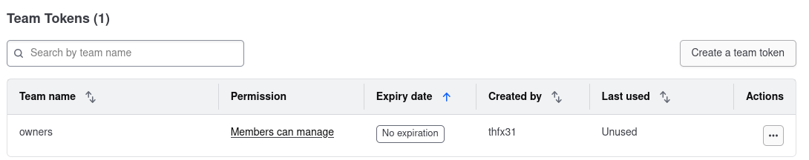

# SDT - Projet Chat Server (WIP)

Ce document a pour objectif de détailler les étapes de conception, d'implémentation et d'évolution d'un
projet de serveur de chat. L’architecture s’améliore au fil des itérations, chaque étape apportant des
améliorations en termes de performances, de scalabilité et de résilience.

&nbsp;

## Paramétrage initial

&nbsp;


### Création du répo github STD
- ajout des membres du groupe

&nbsp;


### Création d'un compte Terraform Cloud par collaborateurs
- Création commpte Hashicorp https://portal.cloud.hashicorp.com/sign-up
- Création d'une organisation
- Invitation des membres du groupe dans l'organisation

&nbsp;


### Mise en place des accès AWS dans terraform cloud
- Création d'une clé ...

```
IAM > Security credentials > Create access key
```
&nbsp;

### Push du code sur github repo STD

```bash
git add .
git commit -m "change_message"
git push
```
&nbsp;

## Itération 1 : Mise en place de base avec GitHub Actions

### Objectif :
Créer une CI/CD permettant ....

&nbsp;

### Connexion Github Actions <=> Terraform Cloud
- Création TF_API_TOKEN sur Terraform Cloud pour permettre à Github Actions de faire un "terraform login"

```
STD > Settings > API Tokens > Teams Tokens
```
&nbsp;



&nbsp;

- Copier le token TF_API_TOKEN sur Github Actions

``` STD > Settings > Actions secrets and variables > New Repository Token```

&nbsp;

### Création d’un premier fichier test.tf pour déployer un **SG**

<details>
  <summary>Cliquer pour dérouler le code</summary>

```hcl
terraform {
  cloud {

    organization = "STD"

    workspaces {
      name = "STD"
    }
  }

  required_providers {
    aws = {
      source  = "hashicorp/aws"
      version = "~> 4.0"
    }
  }
}

provider "aws" {
  region = "eu-west-1"
}

resource "aws_security_group" "example" {
  name        = "std-security-group"
  description = "STD security group"

  ingress {
    from_port   = 22
    to_port     = 22
    protocol    = "tcp"
    cidr_blocks = ["0.0.0.0/0"]
  }

  egress {
    from_port   = 0
    to_port     = 0
    protocol    = "-1"
    cidr_blocks = ["0.0.0.0/0"]
  }

  tags = {
    Name = "std-security-group"
  }
}
```
</details>

&nbsp;

### Création d’un deuxième fichier test.tf pour déployer un **EC2**

<details>
  <summary>Cliquer pour dérouler le code</summary>

```hcl
terraform {
  cloud {
    organization = "STD"

    workspaces {
      name = "STD"
    }
  }

  required_providers {
    aws = {
      source  = "hashicorp/aws"
      version = "~> 4.0"
    }
  }
}

provider "aws" {
  region = "eu-west-1"
}

data "aws_ami" "ecs_optimized_ami" {
  most_recent = true
  owners      = ["amazon"]

  filter {
    name   = "name"
    values = ["amzn2-ami-ecs-hvm-2.0.202*-x86_64-ebs"]
  }
}

resource "aws_instance" "ecs_instance" {
  ami           = data.aws_ami.ecs_optimized_ami.id
  instance_type = "t2.micro"

  tags = {
    Name = "STD-EC2"
  }
}
```
</details>

&nbsp;


### Création d’un troisème fichier test.tf pour déployer un **EC2 + SG**

<details>
  <summary>Cliquer pour dérouler le code</summary>

```hcl
 

 terraform {
  cloud {
    organization = "STD"

    workspaces {
      name = "STD"
    }
  }

  required_providers {
    aws = {
      source  = "hashicorp/aws"
      version = "~> 4.0"
    }
  }
}

provider "aws" {
  region = "eu-west-1"
}

data "aws_ami" "ecs_optimized_ami" {
  most_recent = true
  owners      = ["amazon"]

  filter {
    name   = "name"
    values = ["amzn2-ami-ecs-hvm-2.0.202*-x86_64-ebs"]
  }
}

resource "aws_security_group" "allow_http_ssh" {
  name        = "std-allow-http-ssh"
  description = "Security group to allow HTTP and SSH access"

  ingress {
    description = "Allow HTTP traffic"
    from_port   = 80
    to_port     = 80
    protocol    = "tcp"
    cidr_blocks = ["0.0.0.0/0"]
  }

  ingress {
    description = "Allow SSH traffic"
    from_port   = 22
    to_port     = 22
    protocol    = "tcp"
    cidr_blocks = ["0.0.0.0/0"]
  }

  egress {
    description = "Allow all outbound traffic"
    from_port   = 0
    to_port     = 0
    protocol    = "-1"
    cidr_blocks = ["0.0.0.0/0"]
  }
}

resource "aws_instance" "ecs_instance" {
  vpc_security_group_ids = [aws_security_group.allow_http_ssh.id]

  ami           = data.aws_ami.ecs_optimized_ami.id
  instance_type = "t2.micro"
  key_name      = "SRE-KeyPair"

  tags = {
    Name = "STD-EC2"
  }
}


```
</details>

&nbsp;


### Tentative d'utilisation d'ECR

L'objectif est de stocker l'image docker du tchat sur le registery AWS

<details>
  <summary>Cliquer pour dérouler le code - ecr.tf</summary>

```hcl

resource "aws_ecr_repository" "std_chat" {
  name                 = "std-chat"
  image_tag_mutability = "MUTABLE"
}
```

<details>
  <summary>Cliquer pour dérouler le code - output.tf</summary>

```hcl

output "ecr_repository_url" {
  value = aws_ecr_repository.std_chat.repository_url
}
```
</details>


/!\ Abandon au profit de GHRC (solution native de Github)

&nbsp;

### Mise en place de GHRC
